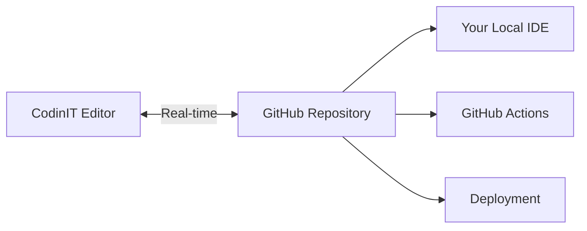
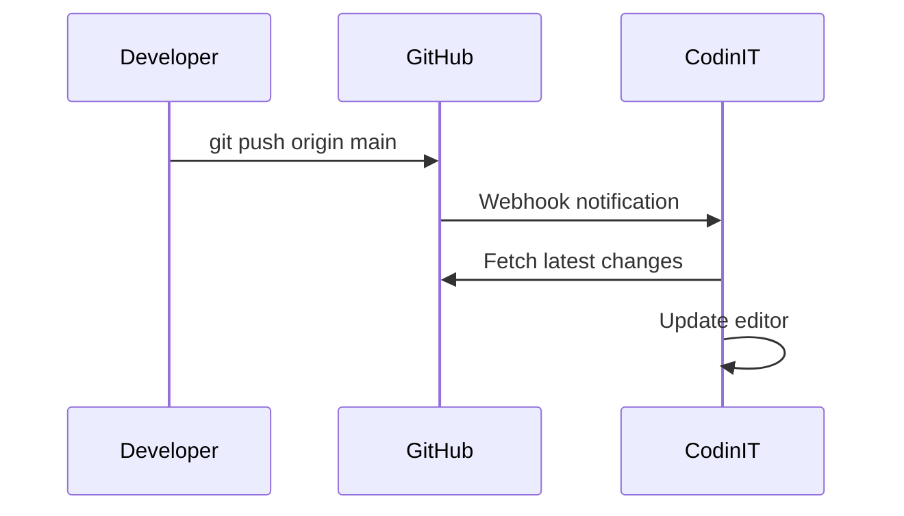
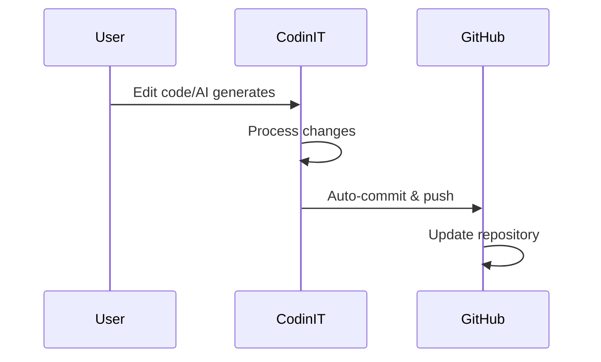

::hero
---
title: GitHub
description: Learn how to connect your CodinIT projects to GitHub for version control, collaboration, and deployment. This guide covers setup, syncing, and best practices.
navigation:
  icon: simple-icons--github"
---
::

::callout{icon="i-heroicons-information-circle" color="blue"}
**TL;DR:** Git is a version control system that tracks changes in your code. GitHub is the industry-standard platform for hosting Git repositories, essential for both solo builders and teams using CodinIT.
::

## Overview

Integrating GitHub into your CodinIT project ensures you have full version control, collaboration tools, and code portability throughout your app's lifecycle.

::card-group
  ::card{icon="i-heroicons-clock" title="Version Control"}
  Track every change with complete Git history and the ability to roll back to any previous state.
  ::
  
  ::card{icon="i-heroicons-users" title="Team Collaboration"}
  Enable developers and contributors to work together using familiar GitHub workflows.
  ::
  
  ::card{icon="i-heroicons-arrow-path" title="Real-time Sync"}
  Automatic bidirectional sync between CodinIT editor and GitHub repository.
  ::
  
  ::card{icon="i-heroicons-rocket-launch" title="Deployment Freedom"}
  Host your app anywhere while maintaining the connection to CodinIT's development tools.
  ::
::

### What is GitHub?

::tabs
  ::div{label="Git"}
  **Git** is a version control system that tracks changes in your code, allowing you to:
  - Save snapshots of your project at different points in time
  - Compare changes between versions
  - Collaborate with multiple developers
  - Revert to previous versions when needed
  ::

  ::div{label="GitHub"}
  **GitHub** is the industry-standard platform for hosting Git repositories, providing:
  - Cloud storage for your code repositories
  - Collaboration tools like pull requests and issues
  - CI/CD integration through GitHub Actions
  - Project management features
  ::

  ::div{label="Integration"}
  **CodinIT + GitHub** combines the best of both worlds:
  - AI-powered development in CodinIT
  - Professional version control with GitHub
  - Seamless sync between both platforms
  - Complete code ownership and portability
  ::
::

## Key Benefits

::alert{icon="i-heroicons-shield-check" color="green"}
**GitHub integration brings transparency, safety, and flexibility to your development process.**
::

### Version History & Backup

::code-group
```bash [Git History]
git log --oneline
a1b2c3d Add user authentication
e4f5g6h Fix signup form validation
i7j8k9l Update landing page design
```

```json [Backup Status]
{
  "status": "backed_up",
  "last_sync": "2025-06-16T10:30:00Z",
  "commits_synced": 47,
  "backup_location": "github.com/username/project"
}
```
::

All your code is tracked with Git, providing an external backup and complete change history.

### Team Collaboration

::steps
1. **Code Review Process**
   
   Team members can review changes via GitHub pull requests before they're merged.

2. **Issue Tracking**
   
   Use GitHub Issues to track bugs, features, and tasks with full project visibility.

3. **Transparent History**
   
   Non-technical stakeholders can see exactly what changed and when.
::

### Real-Time Sync

::callout{icon="i-heroicons-arrow-path" color="emerald"}
**Bidirectional Sync:** Changes flow seamlessly between CodinIT and GitHub in both directions.
::

::code-group


```bash [Example Sync]
# Push from local IDE
git push origin main
# → Automatically appears in CodinIT

# Edit in CodinIT
# → Automatically pushed to GitHub
```
::

### Workflow Integration

::card-group{cols=2}
  ::card{icon="i-heroicons-git-branch" title="Branching Strategy"}
  Use GitHub's branching features alongside CodinIT for organized development.
  ::
  
  ::card{icon="i-heroicons-play" title="CI/CD Pipeline"}
  Set up automated testing and deployment with GitHub Actions.
  ::
  
  ::card{icon="i-heroicons-chat-bubble-left-right" title="Code Reviews"}
  Maintain code quality with pull request reviews and discussions.
  ::
  
  ::card{icon="i-heroicons-bug-ant" title="Issue Tracking"}
  Track bugs and feature requests with GitHub's project management tools.
  ::
::

## Setup Guide

::alert{icon="i-heroicons-clock" color="amber"}
**Setup Time:** Approximately 5-10 minutes for first-time setup
::

::steps
### 1. Initiate GitHub Connection

In the CodinIT editor, click on **GitHub → Connect to GitHub** (usually found in the top-right corner of the project editor).

::callout{icon="i-heroicons-arrow-top-right-on-square"}
This will redirect you to GitHub for authorization.
::

### 2. Authorize CodinIT on GitHub

You'll be redirected to GitHub to authorize the CodinIT GitHub App:

::tabs
  ::div{label="All Repositories"}
  **Recommended for ease of use**
  
  Grants CodinIT access to create repositories in any of your accounts or organizations.
  ::

  ::div{label="Selected Repositories"}
  **More restrictive option**
  
  Choose specific repositories where CodinIT can operate. You can always modify this later.
  ::
::

### 3. Select GitHub Account/Organization

::alert{icon="i-heroicons-exclamation-triangle" color="yellow"}
**Important:** You can only connect one GitHub account per CodinIT account at a time.
::

If your GitHub user belongs to organizations:
- Choose between personal GitHub or organization accounts
- Ensure you have admin access for organization repositories
- Repository will be created under the selected account

### 4. Create the Repository

Once GitHub is connected:

::code-group
```bash [Automatic Process]
1. Click "Create Repository" button
2. CodinIT creates new GitHub repo
3. Initial code push (few seconds)
4. Sync established ✅
```

```json [Repository Structure]
{
  "name": "my-CodinIT-project",
  "visibility": "private",
  "default_branch": "main",
  "files": [
    "package.json",
    "src/",
    "public/",
    "README.md"
  ]
}
```
::

### 5. Verify the Link

::badge{variant="solid" color="green"}Connected::

Check your GitHub account for the new repository containing all your CodinIT app code.
::

## How Syncing Works

::callout{icon="i-heroicons-information-circle" color="blue"}
**Key Concept:** CodinIT and GitHub maintain a real-time, bidirectional sync of your codebase.
::

### Default Branch Sync Only

::alert{icon="i-heroicons-git-branch" color="purple"}
**Important:** CodinIT currently tracks only the **default branch** of your GitHub repository (typically `main` or `master`).
::

::tabs
  ::div{label="Supported"}
  ```bash
  # ✅ These changes sync with CodinIT
  git checkout main
  git commit -m "Add new feature"
  git push origin main
  ```
  ::

  ::div{label="Not Supported"}
  ```bash
  # ❌ These changes don't sync until merged
  git checkout feature/new-component
  git commit -m "Work in progress"
  git push origin feature/new-component
  ```
  ::

  ::div{label="Workflow"}
  ```bash
  # ✅ Proper workflow
  git checkout feature/new-component
  # ... make changes ...
  git push origin feature/new-component
  # Create PR and merge to main
  # Now changes appear in CodinIT!
  ```
  ::
::

### Real-Time Updates

::code-group



::

### Conflict Handling

::alert{icon="i-heroicons-exclamation-triangle" color="red"}
**Rare but possible:** Git conflicts can occur when both CodinIT and GitHub change the same code simultaneously.
::

::steps
1. **Identify Conflict**
   
   Git will flag conflicting changes that can't be automatically merged.

2. **Resolve Manually**
   
   Use GitHub's interface or local tools to resolve conflicts.

3. **Commit Resolution**
   
   Push the resolved code back to the default branch.

4. **Automatic Sync**
   
   CodinIT will pull the resolved code automatically.
::

## Importing Existing Repositories

::callout{icon="i-heroicons-wrench-screwdriver" color="amber"}
**Coming Soon:** Direct import of existing repositories is planned for future updates.
::

### Current Workarounds

::tabs
  ::div{label="Manual Import"}
  ::steps
  1. Create new CodinIT project and connect to GitHub
  2. Clone the new (empty) repository locally
  3. Copy your existing code into the cloned repo
  4. Commit and push to the default branch
  5. CodinIT will sync the imported code automatically
  ::
  ::

  ::div{label="Copy-Paste Method"}
  For smaller projects:
  
  ::code-group
  ```bash [Terminal]
  # Copy individual files
  cp -r old-project/src new-project/src
  cp old-project/package.json new-project/
  ```
  
  ```javascript [CodinIT Editor]
  // Or paste code directly in CodinIT
  // Use AI to help restructure if needed
  ```
  ::
  ::
::

## Parallel Development

::hero{title="Work Your Way" description="Use CodinIT's AI alongside your favorite development tools"}
::

### Development Options

::card-group{cols=3}
  ::card{icon="i-heroicons-code-bracket" title="CodinIT Editor"}
  Use AI-powered development and visual tools for rapid prototyping.
  
  :badge[AI-Powered]{variant="outline" color="green"}
  ::
  
  ::card{icon="i-heroicons-computer-desktop" title="Local IDE"}
  Full IDE experience with debugging, extensions, and advanced tooling.
  
  :badge[Professional]{variant="outline" color="blue"}
  ::
  
  ::card{icon="i-heroicons-cloud" title="GitHub Codespaces"}
  Cloud-based development environment with full GitHub integration.
  
  :badge[Cloud-Based]{variant="outline" color="purple"}
  ::
::

### Example Workflows

::tabs
  ::div{label="Hybrid Development"}
  ```mermaid
  flowchart TD
      A[Founder uses CodinIT AI] --> B[Scaffolds new feature]
      B --> C[Developer refines in IDE]
      C --> D[Code review on GitHub]
      D --> E[Merge to main]
      E --> F[Auto-sync to CodinIT]
      F --> G[Deploy via GitHub Actions]
  ```
  ::

  ::div{label="Team Collaboration"}
  ```mermaid
  flowchart LR
      A[Designer] --> B[CodinIT Prototyping]
      C[Frontend Dev] --> D[Local IDE]
      E[Backend Dev] --> F[GitHub Codespaces]
      B --> G[GitHub Repository]
      D --> G
      F --> G
      G --> H[Continuous Integration]
      H --> I[Deployment]
  ```
  ::
::

### GitHub Workflows

::code-group
```yaml [CI/CD Example]
name: Deploy
on:
  push:
    branches: [main]
jobs:
  deploy:
    runs-on: ubuntu-latest
    steps:
      - uses: actions/checkout@v4
      - name: Deploy to Vercel
        run: vercel --prod
```

```yaml [Testing Pipeline]
name: Tests
on:
  pull_request:
    branches: [main]
jobs:
  test:
    runs-on: ubuntu-latest
    steps:
      - uses: actions/checkout@v4
      - name: Run Tests
        run: npm test
```
::

## Version Management

### Commit Best Practices

::code-group
```bash [Good Examples]
git commit -m "feat: add user authentication system"
git commit -m "fix: resolve signup form validation bug"
git commit -m "docs: update GitHub integration guide"
git commit -m "refactor: optimize database queries"
```

```bash [Bad Examples]
git commit -m "update code"
git commit -m "fixes"
git commit -m "work"
git commit -m "asdf"
```
::

### Rollback Options

::tabs
  ::div{label="CodinIT Rollback"}
  ::steps
  1. Open version history in CodinIT editor
  2. Browse previous project states
  3. Click to restore any previous version
  4. Changes sync automatically to GitHub
  ::
  
  ::badge{variant="solid" color="green"}Beginner-Friendly::
  ::

  ::div{label="Git Revert"}
  ```bash
  # Revert specific commit
  git revert abc123
  git push origin main
  
  # Revert to specific point
  git reset --hard abc123
  git push --force-with-lease origin main
  ```
  
  ::badge{variant="solid" color="blue"}Developer Tool::
  ::

  ::div{label="GitHub Interface"}
  ::steps
  1. Navigate to commit history on GitHub
  2. Click "Revert" button on problematic commit
  3. Create revert pull request
  4. Merge to apply the revert
  ::
  
  ::badge{variant="solid" color="purple"}Web-Based::
  ::
::

## Troubleshooting & FAQ

::details{summary="Why aren't my commits showing up in CodinIT?"}
Check these common issues:

- **Branch**: Ensure you're pushing to the default branch (`main` or `master`)
- **Push Status**: Verify commits were successfully pushed to GitHub
- **Timing**: Wait 10-30 seconds for automatic sync
- **Refresh**: Try refreshing the CodinIT editor

::code-group
```bash [Check Status]
git status
git log --oneline -5
git remote -v
```

```bash [Force Sync]
git push origin main --force-with-lease
# Then refresh CodinIT editor
```
::
::

::details{summary="How do I switch the default branch that CodinIT syncs with?"}
::steps
1. Go to your GitHub repository
2. Navigate to **Settings → General**
3. Find "Default branch" section
4. Click "Switch to another branch"
5. Select your desired branch
6. CodinIT will automatically start syncing with the new default
::

::alert{icon="i-heroicons-exclamation-triangle" color="yellow"}
**Warning:** Switching default branches will change what code appears in CodinIT immediately.
::
::

::details{summary="How does CodinIT detect new commits from GitHub?"}
CodinIT uses **GitHub webhooks** for real-time notifications:

```json
{
  "event": "push",
  "branch": "main",
  "commits": [
    {
      "id": "abc123",
      "message": "Add new feature",
      "timestamp": "2025-06-16T10:30:00Z"
    }
  ]
}
```

When you push to the default branch, GitHub automatically notifies CodinIT, which then pulls the latest changes.
::

::details{summary="Can I host my CodinIT app myself after connecting to GitHub?"}
::badge{variant="solid" color="green"}Yes, absolutely!::

Once connected to GitHub, you have full code ownership and can:

::list{icon="i-heroicons-check"}
- Deploy to any hosting platform (Vercel, Netlify, AWS, etc.)
- Set up your own CI/CD pipelines
- Continue editing in CodinIT while hosting elsewhere
- Maintain complete control of your codebase
- Export and modify code as needed
::

::code-group
```bash [Vercel Deployment]
npm i -g vercel
vercel --prod
```

```bash [Netlify Deployment]
npm run build
netlify deploy --prod --dir=dist
```

```yaml [AWS CloudFormation]
Resources:
  S3Bucket:
    Type: AWS::S3::Bucket
    Properties:
      WebsiteConfiguration:
        IndexDocument: index.html
```
::
::

---

::card{icon="i-heroicons-rocket-launch" color="primary"}
**Ready to Get Started?**

By following this guide, you'll combine the speed of AI-assisted development with the reliability and control of traditional software practices. This integration is designed to be approachable for non-technical users while providing all the power that developers expect in a modern toolchain.

#[Get Started](#setup-guide){.font-semibold}
::

::callout{icon="i-heroicons-heart" color="red"}
**Happy coding!** 🚀
::